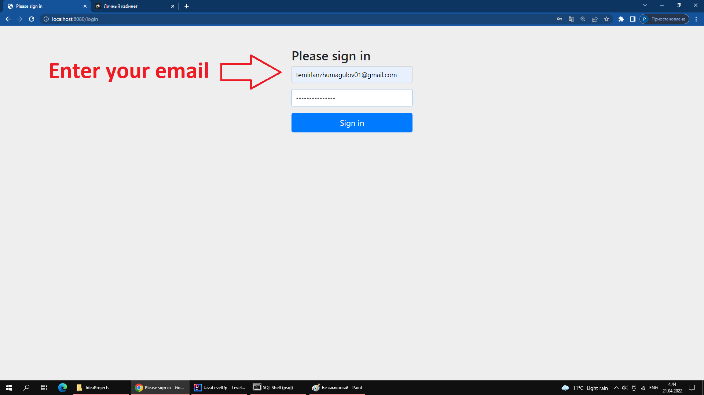
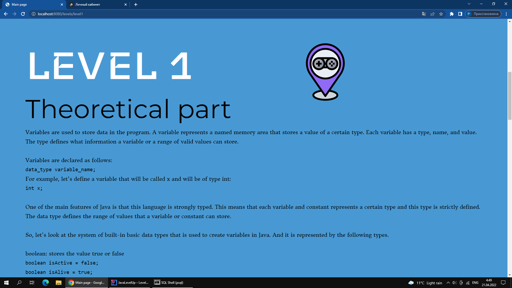
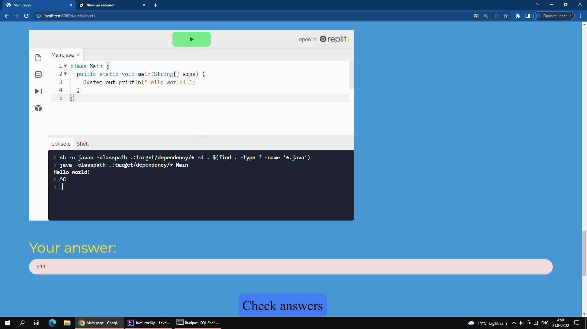

# JavaLevelUp - educational website with sale elements

## Table of contents

- [Overview](#overview)
  - [The challenge](#the-challenge)
  - [Screenshot](#screenshot)
- [My process](#my-process)
  - [Built with](#built-with)
  - [What I learned](#what-i-learned)
  - [Useful resources](#useful-resources)
- [Author](#author)
- [Acknowledgments](#acknowledgments)

## Overview

### The challenge

Users should be able to:

- Register and log into your account, while the passwords in the database must be encrypted
- Buy a java course for $10 via paypal
- Give the correct answers to the questions asked and to the solution of a practical problem in order to pass to the next level
- Give wrong answers and get a response
- When passing the level, it should change color

### Screenshot

### Links

- Design on figma: (https://www.figma.com/file/boc57oMe3lPf75SCcRG2C6/Untitled/)
- Live Site URL: Currently available only via localhost

## My process

### Built with

- Spring Security
- PostgreSQL
- PayPal Developer API
- Hibernate
- Thymeleaf
- Bootstrap
- CSS3
- HTML5
- JavaScript

### Useful resources

- [baeldung](https://www.baeldung.com/spring-data-jpa-query/) - This helped me for writing this query - @Query(value = "SELECT * FROM USERS u WHERE u.email = ?1", nativeQuery = true)
- [justcoded](https://justcoded.com/blog/how-to-integrate-a-payment-gateway-into-a-website/) - it helped me to integrate paypal API

## Author

- Me - [@TemirlanZhumagulov](https://github.com/TemirlanZhumagulov)
- Daniyaruly Danial - [@DaniyarulyDanial]()
- Umirbek Nurbek - [@UmirbekNurbek]()

## Acknowledgments

I am grateful to my team for participating in the layout and coming up with a design, thanks to this, we won the 3rd place at IT FEST 2022 and 50,000₸ in the Information Technology Section (Digital University) - https://itfest.kz/winners/

